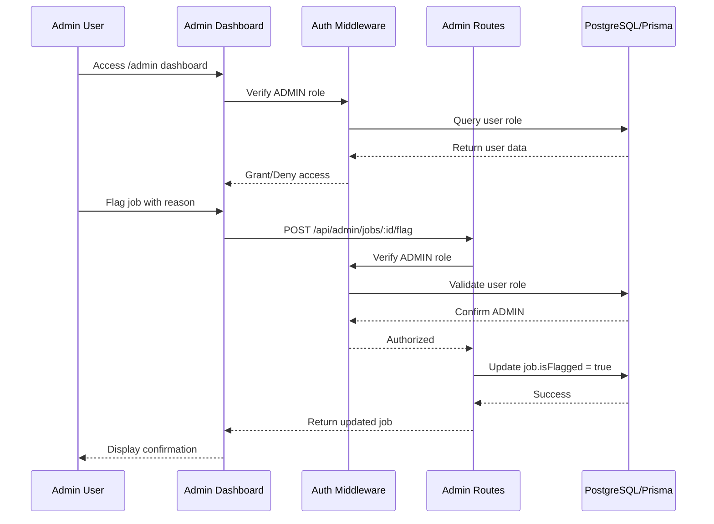

# Admin Moderation System - Design Document

## Overview

The admin moderation system adds content moderation capabilities to the freelance marketplace platform. It enables designated administrators to flag inappropriate jobs, suspend problematic user accounts, and manage moderation activities through a dedicated dashboard interface.

The system extends the existing authentication and authorization infrastructure by introducing an ADMIN role and protecting new admin-only endpoints. The backend provides RESTful API endpoints for moderation actions, while the frontend delivers an admin dashboard with real-time statistics and management interfaces.

### Key Design Goals

- **Role-Based Access Control**: Extend the existing UserRole enum to include ADMIN, ensuring only authorized users can access moderation functionality
- **Content Flagging**: Enable admins to mark jobs and users with reasons for review or action
- **Account Suspension**: Provide mechanisms to temporarily disable user accounts and prevent suspended users from authenticating
- **Admin Dashboard**: Create a dedicated frontend interface for viewing statistics and managing flagged content
- **Security**: Protect all admin endpoints with middleware that verifies ADMIN role authorization

## Architecture

### System Components

The admin moderation system consists of three primary layers:

1. **Data Layer**: Prisma schema extensions for User and Job models to support flagging and suspension
2. **API Layer**: Express routes and middleware for admin operations with role-based access control
3. **UI Layer**: Next.js admin dashboard with React components for moderation management

### Component Interaction Flow



### Technology Stack Integration

- **Backend**: Node.js/Express with existing middleware patterns
- **Database**: PostgreSQL with Prisma ORM for schema migrations
- **Frontend**: Next.js 13+ with App Router, React Server Components
- **Authentication**: JWT tokens with existing auth middleware extended for role checks
- **State Management**: React hooks and context for admin dashboard state

## Components and Interfaces

### Backend Components

#### 1. Prisma Schema Extensions

**User Model Extensions**:
```prisma
model User {
  // ... existing fields
  role          UserRole  @default(FREELANCER)
  isFlagged     Boolean   @default(false)
  flagReason    String?
  isSuspended   Boolean   @default(false)
  suspendReason String?
  suspendedAt   DateTime?
}

enum UserRole {
  CLIENT
  FREELANCER
  ADMIN
}
```

**Job Model Extensions**:
```prisma
model Job {
  // ... existing fields
  isFlagged   Boolean   @default(false)
  flagReason  String?
  flaggedAt   DateTime?
  flaggedBy   String?   // Admin user ID
}
```

#### 2. Auth Middleware Extension

**requireAdmin Middleware**:
```typescript
interface AuthRequest extends Request {
  userId?: string;
  userRole?: UserRole;
}

export const requireAdmin = async (
  req: AuthRequest,
  res: Response,
  next: NextFunction
): Promise<void> => {
  // First authenticate the user
  // Then query database for user role
  // If role !== ADMIN, return 403
  // Otherwise, proceed to next()
}
```

**checkSuspension Middleware**:
```typescript
export const checkSuspension = async (
  req: AuthRequest,
  res: Response,
  next: NextFunction
): Promise<void> => {
  // Query user by userId
  // If user.isSuspended === true, return 403
  // Otherwise, proceed to next()
}
```

#### 3. Admin Routes

**Route Structure**:
- `POST /api/admin/jobs/:id/flag` - Flag a job with reason
- `POST /api/admin/jobs/:id/remove` - Remove/unpublish a job
- `POST /api/admin/jobs/:id/dismiss` - Remove flag from job
- `POST /api/admin/users/:id/suspend` - Suspend user account
- `POST /api/admin/users/:id/restore` - Restore suspended account
- `GET /api/admin/flagged` - List all flagged jobs and suspended users
- `GET /api/admin/stats` - Get moderation statistics

**Admin Controller Functions**:
```typescript
class AdminController {
  async flagJob(req: Request, res: Response): Promise<void>
  async removeJob(req: Request, res: Response): Promise<void>
  async dismissJobFlag(req: Request, res: Response): Promise<void>
  async suspendUser(req: Request, res: Response): Promise<void>
  async restoreUser(req: Request, res: Response): Promise<void>
  async getFlaggedContent(req: Request, res: Response): Promise<void>
  async getStats(req: Request, res: Response): Promise<void>
}
```

#### 4. Validation Schemas

**Zod Schemas**:
```typescript
const flagJobSchema = z.object({
  flagReason: z.string().min(1).max(500)
});

const suspendUserSchema = z.object({
  suspendReason: z.string().min(1).max(500)
});
```

### Frontend Components

#### 1. Admin Dashboard Page

**Route**: `/admin`

**Page Structure**:
```typescript
// app/admin/page.tsx
export default async function AdminDashboard() {
  // Server component that fetches initial data
  // Renders statistics cards and management tables
}
```

**Statistics Display**:
- Total jobs count
- Flagged jobs count
- Total users count
- Suspended users count

#### 2. Flagged Jobs Table Component

**Component Interface**:
```typescript
interface FlaggedJobsTableProps {
  initialJobs: FlaggedJob[];
}

interface FlaggedJob {
  id: string;
  title: string;
  client: { username: string; walletAddress: string };
  flagReason: string;
  flaggedAt: string;
}
```

**Actions**:
- Remove button: Calls DELETE endpoint and removes from list
- Dismiss button: Calls dismiss endpoint and removes flag

#### 3. Suspended Users Table Component

**Component Interface**:
```typescript
interface SuspendedUsersTableProps {
  initialUsers: SuspendedUser[];
}

interface SuspendedUser {
  id: string;
  username: string;
  walletAddress: string;
  suspendReason: string;
  suspendedAt: string;
}
```

**Actions**:
- Restore button: Calls restore endpoint and removes from list

#### 4. Admin Route Protection

**Middleware**: `frontend/src/middleware.ts`
```typescript
export function middleware(request: NextRequest) {
  // Check if route starts with /admin
  // Verify JWT token and decode user role
  // If role !== ADMIN, redirect to unauthorized page
}
```

## Data Models

### Extended User Model

```typescript
interface User {
  id: string;
  walletAddress: string;
  username: string;
  email?: string;
  bio?: string;
  avatarUrl?: string;
  role: "CLIENT" | "FREELANCER" | "ADMIN";
  isFlagged: boolean;
  flagReason?: string;
  isSuspended: boolean;
  suspendReason?: string;
  suspendedAt?: string;
  createdAt: string;
  updatedAt: string;
}
```

### Extended Job Model

```typescript
interface Job {
  id: string;
  title: string;
  description: string;
  budget: number;
  category: string;
  status: JobStatus;
  isFlagged: boolean;
  flagReason?: string;
  flaggedAt?: string;
  flaggedBy?: string;
  client: User;
  freelancer?: User;
  createdAt: string;
  updatedAt: string;
}
```

### Admin API Response Types

```typescript
interface FlaggedContentResponse {
  flaggedJobs: Array<{
    id: string;
    title: string;
    client: {
      id: string;
      username: string;
      walletAddress: string;
    };
    flagReason: string;
    flaggedAt: string;
  }>;
  suspendedUsers: Array<{
    id: string;
    username: string;
    walletAddress: string;
    suspendReason: string;
    suspendedAt: string;
  }>;
}

interface AdminStatsResponse {
  totalJobs: number;
  flaggedJobs: number;
  totalUsers: number;
  suspendedUsers: number;
}
```


## Correctness Properties

*A property is a characteristic or behavior that should hold true across all valid executions of a system-essentially, a formal statement about what the system should do. Properties serve as the bridge between human-readable specifications and machine-verifiable correctness guarantees.*

### Property Reflection

After analyzing all acceptance criteria, I identified several areas of redundancy:

1. **Authorization checks (3.3, 4.3, 5.3, 6.3, 7.5, 8.2)**: All specify that non-admin users should receive 403 for admin endpoints. These can be consolidated into a single comprehensive property.

2. **Not found errors (3.4, 4.4, 5.4, 6.4)**: All specify that non-existent IDs should return 404. These can be consolidated into a single property about resource validation.

3. **Flagging operations (2.3, 3.2)**: Both test the same behavior - that flagging a job sets isFlagged to true and stores the reason. These are redundant.

4. **UI data completeness (7.3, 11.2) and (7.4, 12.2)**: The API response requirements and UI display requirements test the same data completeness. The UI properties subsume the API properties since the UI must display what the API returns.

5. **Persistence (1.3)**: This is a general database concern that's implicitly tested by all other properties that verify data changes. It's redundant with the specific operation properties.

After consolidation, the following properties provide comprehensive, non-redundant coverage:

### Property 1: Admin role grants access to admin endpoints

*For any* user with ADMIN role and valid authentication, requests to any /api/admin/* endpoint should be processed (not rejected with 403 due to authorization).

**Validates: Requirements 1.2, 8.1**

### Property 2: Non-admin users are denied access to admin endpoints

*For any* authenticated user without ADMIN role, requests to any /api/admin/* endpoint should return a 403 status code.

**Validates: Requirements 3.3, 4.3, 5.3, 6.3, 7.5, 8.2**

### Property 3: Unauthenticated requests to admin endpoints are rejected

*For any* request to /api/admin/* endpoints without valid authentication, the system should return a 401 status code.

**Validates: Requirements 8.3**

### Property 4: Flagging a job sets flag status and stores reason

*For any* job and any valid flag reason, when an admin flags the job, the job's isFlagged field should be true and flagReason should equal the provided reason.

**Validates: Requirements 2.3, 3.2**

### Property 5: Flagging a user sets flag status and stores reason

*For any* user and any valid flag reason, when an admin flags the user, the user's isFlagged field should be true and flagReason should equal the provided reason.

**Validates: Requirements 2.4**

### Property 6: Suspending a user sets suspension status and stores reason

*For any* user and any valid suspension reason, when an admin suspends the user, the user's isSuspended field should be true and suspendReason should equal the provided reason.

**Validates: Requirements 5.2**

### Property 7: Restoring a user removes suspension status

*For any* suspended user, when an admin restores the user, the user's isSuspended field should be false.

**Validates: Requirements 6.2**

### Property 8: Removing a job makes it inaccessible

*For any* job, when an admin removes the job, subsequent queries for that job should return 404 or the job should be marked as deleted/unpublished.

**Validates: Requirements 4.2**

### Property 9: Non-existent resource IDs return 404

*For any* admin endpoint that accepts a resource ID (job or user), providing a non-existent ID should return a 404 status code.

**Validates: Requirements 3.4, 4.4, 5.4, 6.4**

### Property 10: Missing required fields return 400

*For any* admin endpoint that requires a reason field (flagReason or suspendReason), omitting the field should return a 400 status code.

**Validates: Requirements 3.5, 5.5**

### Property 11: Flagged content query returns only flagged items

*For any* database state, the GET /api/admin/flagged endpoint should return exactly the jobs where isFlagged is true and exactly the users where isSuspended is true, with no false positives or false negatives.

**Validates: Requirements 7.2**

### Property 12: Flagged job responses contain all required fields

*For any* flagged job returned by the API or displayed in the UI, the response should include job title, client username, client wallet address, flag reason, and flagged date.

**Validates: Requirements 7.3, 11.2**

### Property 13: Suspended user responses contain all required fields

*For any* suspended user returned by the API or displayed in the UI, the response should include username, wallet address, and suspension reason.

**Validates: Requirements 7.4, 12.2**

### Property 14: Suspended users cannot authenticate

*For any* user where isSuspended is true, login attempts should return a 403 status code with an error message indicating the account is suspended.

**Validates: Requirements 9.1, 9.2**

### Property 15: Non-suspended users can authenticate normally

*For any* user where isSuspended is false and credentials are valid, login attempts should succeed and return an authentication token.

**Validates: Requirements 9.3**

### Property 16: Admin dashboard is accessible to admin users

*For any* user with ADMIN role, navigating to /admin should render the admin dashboard interface with statistics displayed.

**Validates: Requirements 10.2, 10.4**

### Property 17: Admin dashboard denies access to non-admin users

*For any* user without ADMIN role, attempting to access /admin should result in a redirect to an unauthorized page or a 403 error.

**Validates: Requirements 10.3**

### Property 18: Remove button deletes job and updates UI

*For any* flagged job in the admin dashboard, clicking the Remove button should call the removal endpoint and remove the job from the displayed table.

**Validates: Requirements 11.3, 11.5**

### Property 19: Dismiss button unflags job and updates UI

*For any* flagged job in the admin dashboard, clicking the Dismiss button should set isFlagged to false and remove the job from the flagged jobs table.

**Validates: Requirements 11.4, 11.6**

### Property 20: Restore button unsuspends user and updates UI

*For any* suspended user in the admin dashboard, clicking the Restore button should call the restoration endpoint and remove the user from the suspended users table.

**Validates: Requirements 12.3, 12.4**

## Error Handling

### Backend Error Handling

**Authentication Errors**:
- 401 Unauthorized: Missing or invalid JWT token
- 403 Forbidden: Valid token but insufficient permissions (non-admin user)
- 403 Forbidden: Suspended user attempting to authenticate

**Validation Errors**:
- 400 Bad Request: Missing required fields (flagReason, suspendReason)
- 400 Bad Request: Invalid field formats or values
- 400 Bad Request: Malformed request body

**Resource Errors**:
- 404 Not Found: Job ID or User ID does not exist
- 404 Not Found: Attempting to access removed/deleted job

**Server Errors**:
- 500 Internal Server Error: Database connection failures
- 500 Internal Server Error: Unexpected exceptions in admin operations

### Error Response Format

All error responses follow a consistent structure:

```typescript
interface ErrorResponse {
  error: string;           // Human-readable error message
  code?: string;           // Optional error code for client handling
  details?: unknown;       // Optional additional error details
}
```

### Frontend Error Handling

**Network Errors**:
- Display toast notification with retry option
- Log error details for debugging
- Maintain UI state to allow user recovery

**Authorization Errors**:
- Redirect to login page for 401 errors
- Display "Access Denied" message for 403 errors
- Clear invalid tokens from storage

**Validation Errors**:
- Display inline error messages on form fields
- Highlight invalid inputs
- Prevent form submission until errors are resolved

**User Feedback**:
- Success toast notifications for completed actions
- Loading states during API calls
- Confirmation dialogs for destructive actions (Remove, Suspend)

## Testing Strategy

### Dual Testing Approach

The admin moderation system requires both unit tests and property-based tests for comprehensive coverage:

- **Unit tests**: Verify specific examples, edge cases, and integration points
- **Property-based tests**: Verify universal properties across all inputs

### Unit Testing

**Backend Unit Tests**:

1. **Middleware Tests**:
   - Test requireAdmin middleware with admin user (should pass)
   - Test requireAdmin middleware with non-admin user (should return 403)
   - Test requireAdmin middleware with no token (should return 401)
   - Test checkSuspension middleware with suspended user (should return 403)
   - Test checkSuspension middleware with non-suspended user (should pass)

2. **Route Handler Tests**:
   - Test flagJob with valid input (should update job)
   - Test flagJob with missing reason (should return 400)
   - Test flagJob with non-existent ID (should return 404)
   - Test suspendUser with valid input (should update user)
   - Test restoreUser on suspended user (should clear suspension)
   - Test getFlaggedContent returns correct filtered data

3. **Integration Tests**:
   - Test complete flow: flag job → query flagged → dismiss flag
   - Test complete flow: suspend user → verify login blocked → restore user
   - Test admin dashboard data fetching with mixed database state

**Frontend Unit Tests**:

1. **Component Tests**:
   - Test FlaggedJobsTable renders job data correctly
   - Test SuspendedUsersTable renders user data correctly
   - Test Remove button click triggers API call
   - Test Restore button click triggers API call
   - Test UI updates after successful API response

2. **Route Protection Tests**:
   - Test /admin route redirects non-admin users
   - Test /admin route renders for admin users
   - Test middleware checks JWT and role correctly

3. **Error Handling Tests**:
   - Test error toast displays on API failure
   - Test loading states during async operations
   - Test confirmation dialogs for destructive actions

### Property-Based Testing

**Property-Based Testing Library**: We will use **fast-check** for TypeScript/JavaScript property-based testing.

**Configuration**: Each property test must run a minimum of 100 iterations to ensure comprehensive input coverage.

**Test Tagging**: Each property test must include a comment tag referencing the design document property:
```typescript
// Feature: admin-moderation-system, Property 1: Admin role grants access to admin endpoints
```

**Backend Property Tests**:

1. **Property 1 Test**: Generate random users with ADMIN role, verify all admin endpoints are accessible
2. **Property 2 Test**: Generate random users with CLIENT or FREELANCER roles, verify all admin endpoints return 403
3. **Property 3 Test**: Generate requests without auth tokens, verify all admin endpoints return 401
4. **Property 4 Test**: Generate random jobs and flag reasons, verify flagging sets isFlagged=true and stores reason
5. **Property 5 Test**: Generate random users and flag reasons, verify flagging sets isFlagged=true and stores reason
6. **Property 6 Test**: Generate random users and suspension reasons, verify suspending sets isSuspended=true and stores reason
7. **Property 7 Test**: Generate random suspended users, verify restoring sets isSuspended=false
8. **Property 8 Test**: Generate random jobs, verify removal makes them inaccessible (404 or deleted status)
9. **Property 9 Test**: Generate random non-existent IDs, verify all admin endpoints return 404
10. **Property 10 Test**: Generate requests with missing reason fields, verify endpoints return 400
11. **Property 11 Test**: Generate random database states with mixed flagged/unflagged jobs and suspended/active users, verify query returns exactly the flagged/suspended items
12. **Property 12 Test**: Generate random flagged jobs, verify API responses contain all required fields (title, client info, reason, date)
13. **Property 13 Test**: Generate random suspended users, verify API responses contain all required fields (username, wallet, reason)
14. **Property 14 Test**: Generate random suspended users, verify login attempts return 403 with suspension message
15. **Property 15 Test**: Generate random non-suspended users with valid credentials, verify login succeeds

**Frontend Property Tests**:

16. **Property 16 Test**: Generate random admin users, verify /admin route renders dashboard with statistics
17. **Property 17 Test**: Generate random non-admin users, verify /admin route denies access
18. **Property 18 Test**: Generate random flagged jobs in UI, verify Remove button calls endpoint and updates table
19. **Property 19 Test**: Generate random flagged jobs in UI, verify Dismiss button unflags and updates table
20. **Property 20 Test**: Generate random suspended users in UI, verify Restore button calls endpoint and updates table

### Test Data Generation

**Generators for Property Tests**:

```typescript
// User generators
const adminUserGen = fc.record({
  id: fc.uuid(),
  walletAddress: fc.hexaString({ minLength: 42, maxLength: 42 }),
  username: fc.string({ minLength: 3, maxLength: 20 }),
  role: fc.constant('ADMIN'),
  isSuspended: fc.boolean(),
});

const nonAdminUserGen = fc.record({
  id: fc.uuid(),
  walletAddress: fc.hexaString({ minLength: 42, maxLength: 42 }),
  username: fc.string({ minLength: 3, maxLength: 20 }),
  role: fc.oneof(fc.constant('CLIENT'), fc.constant('FREELANCER')),
  isSuspended: fc.boolean(),
});

// Job generators
const jobGen = fc.record({
  id: fc.uuid(),
  title: fc.string({ minLength: 5, maxLength: 100 }),
  description: fc.string({ minLength: 10, maxLength: 500 }),
  budget: fc.float({ min: 0, max: 100000 }),
  isFlagged: fc.boolean(),
  flagReason: fc.option(fc.string({ minLength: 1, maxLength: 500 })),
});

// Reason generators
const flagReasonGen = fc.string({ minLength: 1, maxLength: 500 });
const suspendReasonGen = fc.string({ minLength: 1, maxLength: 500 });
```

### Coverage Goals

- **Backend**: 90%+ code coverage for admin routes and middleware
- **Frontend**: 85%+ code coverage for admin dashboard components
- **Property Tests**: 100% of identified properties must have corresponding tests
- **Integration**: All critical user flows must have end-to-end tests

### Continuous Integration

All tests (unit and property-based) must pass in CI pipeline before merging:
- Run on every pull request
- Run on main branch commits
- Block deployment if tests fail
- Generate coverage reports for review
