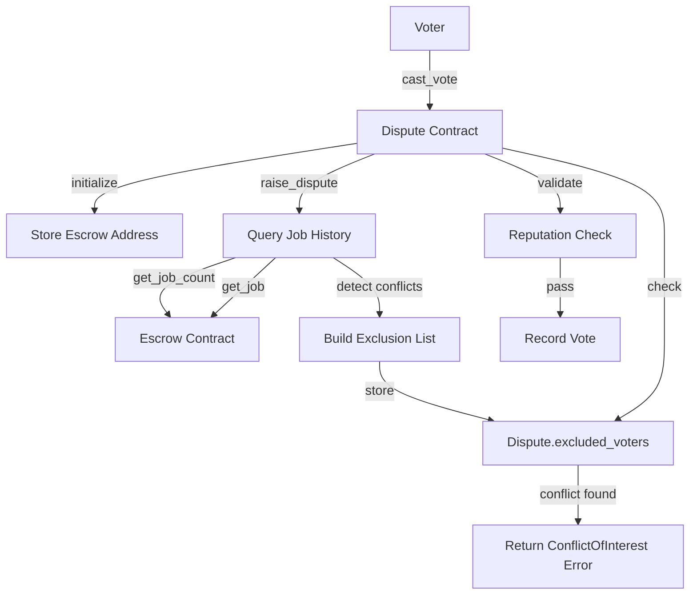
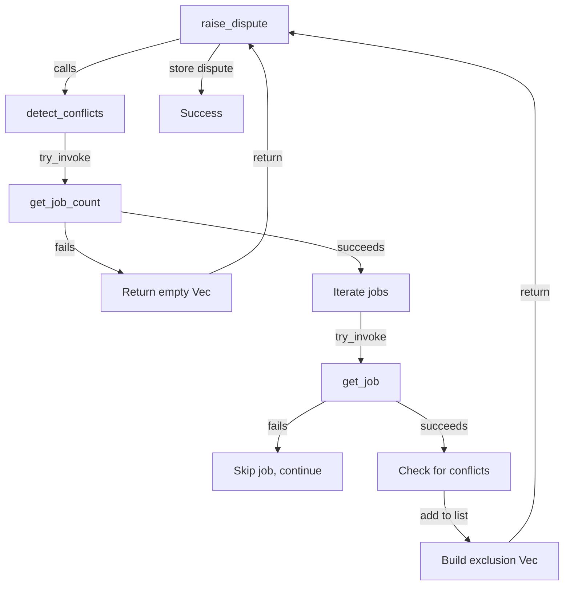

# Design Document: Voter Conflict of Interest Detection

## Overview

This feature implements conflict of interest detection for the dispute resolution system by identifying voters who have prior working relationships with disputing parties. The system prevents biased voting by cross-referencing job history in the escrow contract and maintaining an exclusion list of conflicted voters.

The implementation extends the existing dispute contract with:
- Cross-contract integration with the escrow contract
- Automated conflict detection at dispute creation time
- Manual voter exclusion capabilities during the open phase
- Vote-time validation to enforce exclusions

### Key Design Decisions

1. **Cross-Contract Architecture**: The dispute contract queries the escrow contract rather than duplicating job data, maintaining a single source of truth for job history.

2. **Eager Conflict Detection**: Conflicts are detected and recorded at dispute creation time rather than lazily at vote time, providing transparency and reducing gas costs for voters.

3. **Graceful Degradation**: If escrow queries fail, the system continues operating without conflict detection rather than blocking dispute functionality.

4. **Storage Efficiency**: The excluded voters list is stored as a Vec<Address> within the Dispute struct, leveraging existing TTL management.

## Architecture

### Component Interaction



### Data Flow

1. **Initialization Phase**:
   - Admin provides escrow contract address during dispute contract initialization
   - Address stored in instance storage with TTL management

2. **Dispute Creation Phase**:
   - System queries escrow for total job count
   - Iterates through all jobs (1 to job_count)
   - For each job, extracts client and freelancer addresses
   - Compares job participants against disputing parties
   - Builds excluded_voters list with all conflicted addresses
   - Deduplicates the list before storage

3. **Vote Casting Phase**:
   - Voter submits vote
   - System checks excluded_voters list first
   - If excluded, returns ConflictOfInterest error immediately
   - If not excluded, proceeds with reputation and other validations

4. **Manual Exclusion Phase**:
   - Disputing party calls add_excluded_voter during Open status
   - System validates caller authorization
   - Appends voter to excluded_voters list
   - Emits event for transparency

## Components and Interfaces

### Modified Dispute Struct

```rust
#[contracttype]
#[derive(Clone, Debug, Eq, PartialEq)]
pub struct Dispute {
    pub id: u64,
    pub job_id: u64,
    pub client: Address,
    pub freelancer: Address,
    pub initiator: Address,
    pub reason: String,
    pub status: DisputeStatus,
    pub votes_for_client: u32,
    pub votes_for_freelancer: u32,
    pub min_votes: u32,
    pub created_at: u64,
    pub excluded_voters: Vec<Address>,  // NEW FIELD
}
```

### Extended DataKey Enum

```rust
#[contracttype]
#[derive(Clone, Debug, Eq, PartialEq)]
enum DataKey {
    Dispute(u64),
    DisputeCount,
    Votes(u64),
    HasVoted(u64, Address),
    ReputationContract,
    MinVoterReputation,
    Admin,
    EscrowContract,  // NEW KEY
}
```

### New Error Variant

```rust
#[contracterror]
#[derive(Copy, Clone, Debug, Eq, PartialEq, PartialOrd, Ord)]
#[repr(u32)]
pub enum DisputeError {
    // ... existing errors ...
    ConflictOfInterest = 10,  // NEW ERROR
}
```

### Function Signatures

#### Modified: initialize

```rust
pub fn initialize(
    env: Env,
    admin: Address,
    reputation_contract: Address,
    min_voter_reputation: u32,
    escrow_contract: Address,  // NEW PARAMETER
) -> Result<(), DisputeError>
```

Stores the escrow contract address in instance storage for later queries.

#### New: add_excluded_voter

```rust
pub fn add_excluded_voter(
    env: Env,
    dispute_id: u64,
    caller: Address,
    voter: Address,
) -> Result<(), DisputeError>
```

Allows disputing parties to manually exclude voters during the Open phase.

**Authorization**: Caller must be either the client or freelancer of the dispute.

**Validation**:
- Dispute must exist
- Dispute status must be Open
- Caller must be authorized

**Side Effects**:
- Appends voter to excluded_voters
- Extends TTL for dispute
- Emits exclusion event

#### New: is_excluded_voter

```rust
pub fn is_excluded_voter(
    env: Env,
    dispute_id: u64,
    voter: Address,
) -> bool
```

Query function to check if a voter is excluded from a specific dispute.

**Returns**: 
- `true` if voter is in excluded_voters list
- `false` if voter is not excluded or dispute doesn't exist

#### Internal: detect_conflicts

```rust
fn detect_conflicts(
    env: &Env,
    escrow_contract: &Address,
    client: &Address,
    freelancer: &Address,
) -> Vec<Address>
```

Internal helper function that queries escrow contract and builds the exclusion list.

**Algorithm**:
1. Query get_job_count from escrow
2. If count is 0 or query fails, return empty Vec
3. For job_id in 1..=job_count:
   - Call get_job(job_id) on escrow
   - If call fails, skip to next job
   - Extract job.client and job.freelancer
   - If job.client or job.freelancer matches dispute client:
     - Add job.freelancer to conflicts (if not already present)
     - Add job.client to conflicts (if not already present and not dispute client)
   - If job.client or job.freelancer matches dispute freelancer:
     - Add job.client to conflicts (if not already present)
     - Add job.freelancer to conflicts (if not already present and not dispute freelancer)
4. Remove dispute client and freelancer from conflicts list
5. Return deduplicated Vec<Address>

### Cross-Contract Interface

The dispute contract calls these escrow contract functions:

```rust
// From escrow contract
pub fn get_job_count(env: Env) -> u64

pub fn get_job(env: Env, job_id: u64) -> Result<Job, EscrowError>
```

The Job struct from escrow contains:
```rust
pub struct Job {
    pub id: u64,
    pub client: Address,
    pub freelancer: Address,
    // ... other fields
}
```

### Modified Functions

#### raise_dispute

Enhanced to perform conflict detection:

```rust
pub fn raise_dispute(
    env: Env,
    job_id: u64,
    client: Address,
    freelancer: Address,
    initiator: Address,
    reason: String,
    min_votes: u32,
) -> Result<u64, DisputeError>
```

**Changes**:
1. After creating dispute struct, call detect_conflicts
2. Set dispute.excluded_voters to the returned list
3. Continue with existing storage and event logic

#### cast_vote

Enhanced to check exclusion list:

```rust
pub fn cast_vote(
    env: Env,
    dispute_id: u64,
    voter: Address,
    choice: VoteChoice,
    reason: String,
) -> Result<(), DisputeError>
```

**Changes**:
1. After loading dispute, check if voter is in excluded_voters
2. If found, return ConflictOfInterest error
3. Continue with existing validation logic (parties check, reputation, already voted)

## Data Models

### Storage Layout

| Key | Storage Type | Value Type | TTL Management |
|-----|-------------|------------|----------------|
| EscrowContract | Instance | Address | Extended with dispute count |
| Dispute(id) | Persistent | Dispute | Extended on access |

### Dispute Struct Changes

The `excluded_voters` field is added to the existing Dispute struct:

```rust
pub excluded_voters: Vec<Address>
```

This field:
- Initialized as empty Vec during raise_dispute
- Populated by detect_conflicts at creation time
- Can be appended to via add_excluded_voter
- Checked during cast_vote validation
- Stored with same TTL as parent Dispute

### Memory Considerations

**Vec<Address> Size**: Each Address is 32 bytes. For a typical dispute:
- 10 excluded voters = 320 bytes
- 50 excluded voters = 1,600 bytes
- 100 excluded voters = 3,200 bytes

**Job Iteration**: The detect_conflicts function iterates through all jobs in the escrow contract. For a system with:
- 1,000 jobs: 1,000 cross-contract calls
- 10,000 jobs: 10,000 cross-contract calls

This is acceptable for dispute creation (one-time cost) but would be prohibitive at vote time (hence the eager detection approach).


## Correctness Properties

*A property is a characteristic or behavior that should hold true across all valid executions of a system—essentially, a formal statement about what the system should do. Properties serve as the bridge between human-readable specifications and machine-verifiable correctness guarantees.*

### Property Reflection

After analyzing the acceptance criteria, I identified several areas of redundancy:

1. **Conflict Detection Properties**: Requirements 2.4 and 6.2 both test that conflicted voters are rejected, but 2.4 is about job history conflicts while 6.2 is about the excluded list. These are complementary and both needed.

2. **Error Handling**: Requirements 8.3 and 10.2 both specify that failed job queries should be skipped. These can be combined into a single property about resilience.

3. **Query Behavior**: Requirements 5.2 and 5.3 test the positive and negative cases of is_excluded_voter. These can be combined into a single property about query correctness.

4. **Authorization**: Requirement 4.2 tests unauthorized callers are rejected. This is a single property about access control.

### Property 1: Conflicted Voters Are Rejected

*For any* voter who has worked with either disputing party in any previous job, when that voter attempts to cast a vote on the dispute, the system shall return a ConflictOfInterest error.

**Validates: Requirements 2.4, 6.2**

### Property 2: Non-Conflicted Voters Can Vote

*For any* voter who has no shared job history with either disputing party and is not manually excluded, when that voter attempts to cast a vote with sufficient reputation, the system shall proceed with vote validation and not return a ConflictOfInterest error.

**Validates: Requirements 2.5**

### Property 3: Unauthorized Exclusion Rejected

*For any* address that is neither the client nor the freelancer of a dispute, when that address attempts to call add_excluded_voter, the system shall return an Unauthorized error.

**Validates: Requirements 4.2**

### Property 4: Exclusion Only During Open Status

*For any* dispute with status other than Open, when add_excluded_voter is called by an authorized party, the system shall return a VotingClosed error.

**Validates: Requirements 4.3**

### Property 5: Manual Exclusion Adds Voter

*For any* authorized caller (client or freelancer) on a dispute with Open status, when add_excluded_voter is called with a voter address, that voter address shall appear in the excluded_voters list after the call completes.

**Validates: Requirements 4.4**

### Property 6: Exclusion Query Correctness

*For any* dispute and voter address, is_excluded_voter shall return true if and only if the voter address exists in the dispute's excluded_voters list.

**Validates: Requirements 5.2, 5.3**

### Property 7: Complete Conflict Detection

*For any* job history in the escrow contract, when a dispute is raised, all addresses that have worked with either disputing party shall appear in the excluded_voters list.

**Validates: Requirements 7.3**

### Property 8: No Duplicate Exclusions

*For any* dispute's excluded_voters list, no address shall appear more than once in the list.

**Validates: Requirements 7.4**

### Property 9: Resilient Job Query

*For any* job in the escrow contract that fails to load or returns an error, the conflict detection process shall continue checking remaining jobs and shall not fail the dispute creation.

**Validates: Requirements 8.3, 10.2, 10.4**

## Error Handling

### Error Types

The feature introduces one new error variant:

```rust
ConflictOfInterest = 10
```

Returned when:
- A voter with shared job history attempts to vote
- A manually excluded voter attempts to vote

### Cross-Contract Error Handling

The system implements graceful degradation for escrow contract queries:

1. **Escrow Not Initialized**: If no escrow address is stored, detect_conflicts returns an empty Vec and dispute creation proceeds normally.

2. **get_job_count Fails**: If the query fails or returns 0, detect_conflicts returns an empty Vec.

3. **get_job Fails**: If an individual job query fails, that job is skipped and iteration continues with the next job_id.

4. **Partial Failures**: Even if some jobs fail to load, the system builds the exclusion list from successfully loaded jobs.

### Error Propagation



### Validation Order in cast_vote

The validation checks occur in this order:

1. Load dispute (DisputeNotFound if missing)
2. Check dispute status (VotingClosed if resolved)
3. Check if voter is disputing party (InvalidParty)
4. **Check excluded_voters list (ConflictOfInterest if found)** ← NEW
5. Check reputation (InsufficientReputation if below threshold)
6. Check if already voted (AlreadyVoted if duplicate)
7. Record vote

This ordering ensures that conflict checks happen before expensive reputation queries.

## Testing Strategy

### Dual Testing Approach

The feature requires both unit tests and property-based tests for comprehensive coverage:

**Unit Tests** focus on:
- Specific examples of conflict scenarios
- Edge cases (empty job history, non-existent disputes)
- Integration with mock escrow contracts
- Event emission verification
- Error handling paths

**Property-Based Tests** focus on:
- Universal properties across all job histories
- Conflict detection completeness
- Authorization rules
- Query correctness
- Resilience to failures

### Property-Based Testing Configuration

**Library**: Use `proptest` crate for Rust property-based testing

**Configuration**: Each property test shall run minimum 100 iterations

**Tagging**: Each test must reference its design property:
```rust
// Feature: voter-conflict-of-interest-detection, Property 1: Conflicted Voters Are Rejected
```

### Test Structure

#### Mock Escrow Contract

Create a test helper that implements the escrow interface:

```rust
#[contract]
pub struct MockEscrow {
    jobs: Map<u64, Job>,
    job_count: u64,
}

impl MockEscrow {
    pub fn get_job_count(env: Env) -> u64
    pub fn get_job(env: Env, job_id: u64) -> Result<Job, EscrowError>
    pub fn add_test_job(env: Env, client: Address, freelancer: Address) -> u64
}
```

#### Unit Test Coverage

1. **Initialization Tests**:
   - Test initialize accepts escrow_contract parameter
   - Test escrow address is stored correctly
   - Test initialization with invalid addresses

2. **Conflict Detection Tests**:
   - Test voter who worked with client is excluded
   - Test voter who worked with freelancer is excluded
   - Test voter who worked with both is excluded
   - Test voter with no history is not excluded
   - Test empty job history results in empty exclusion list
   - Test failed job queries don't break dispute creation

3. **Manual Exclusion Tests**:
   - Test client can add excluded voter during Open status
   - Test freelancer can add excluded voter during Open status
   - Test unauthorized caller is rejected
   - Test exclusion during Voting status is rejected
   - Test exclusion event is emitted

4. **Query Tests**:
   - Test is_excluded_voter returns true for excluded voters
   - Test is_excluded_voter returns false for non-excluded voters
   - Test is_excluded_voter returns false for non-existent disputes

5. **Vote Validation Tests**:
   - Test excluded voter cannot cast vote
   - Test non-excluded voter can cast vote
   - Test manually excluded voter cannot cast vote
   - Test conflict check happens before reputation check

#### Property-Based Test Coverage

1. **Property 1 Test**: Generate random job histories where voter shares jobs with disputing parties, verify ConflictOfInterest error

2. **Property 2 Test**: Generate random job histories where voter has no shared jobs, verify vote proceeds

3. **Property 3 Test**: Generate random addresses that are not disputing parties, verify Unauthorized error

4. **Property 4 Test**: Generate disputes with various non-Open statuses, verify VotingClosed error

5. **Property 5 Test**: Generate random voter addresses, verify they appear in exclusion list after add_excluded_voter

6. **Property 6 Test**: Generate random disputes and voters, verify is_excluded_voter matches list membership

7. **Property 7 Test**: Generate random job histories, verify all conflicted addresses are in exclusion list

8. **Property 8 Test**: Generate random job histories with duplicate conflicts, verify no duplicates in final list

9. **Property 9 Test**: Generate job histories with random failures, verify dispute creation succeeds

### Test Data Generators

For property-based tests, create generators for:

```rust
// Generate random addresses
fn arb_address() -> impl Strategy<Value = Address>

// Generate random job with specified participants
fn arb_job(client: Address, freelancer: Address) -> impl Strategy<Value = Job>

// Generate random job history with controlled conflicts
fn arb_job_history_with_conflicts(
    dispute_client: Address,
    dispute_freelancer: Address,
    num_conflicts: usize,
) -> impl Strategy<Value = Vec<Job>>

// Generate random dispute status
fn arb_dispute_status() -> impl Strategy<Value = DisputeStatus>
```

### Integration Testing

Integration tests should verify:
- Cross-contract calls work with real escrow contract
- TTL management works correctly
- Storage limits are respected
- Gas costs are reasonable for typical job counts

### Performance Considerations

**Conflict Detection Cost**: For N jobs, detect_conflicts makes N+1 cross-contract calls. Test with:
- 10 jobs (typical small system)
- 100 jobs (medium system)
- 1,000 jobs (large system)

Measure gas costs and ensure they're acceptable for dispute creation (one-time cost).

**Vote Validation Cost**: Checking excluded_voters is O(n) where n is the list size. Test with:
- 10 excluded voters
- 50 excluded voters
- 100 excluded voters

Ensure vote casting remains efficient.

### Test Execution

Run tests with:
```bash
cargo test --package dispute
cargo test --package dispute -- --nocapture  # For detailed output
```

Run property tests with increased iterations:
```bash
PROPTEST_CASES=1000 cargo test --package dispute
```
